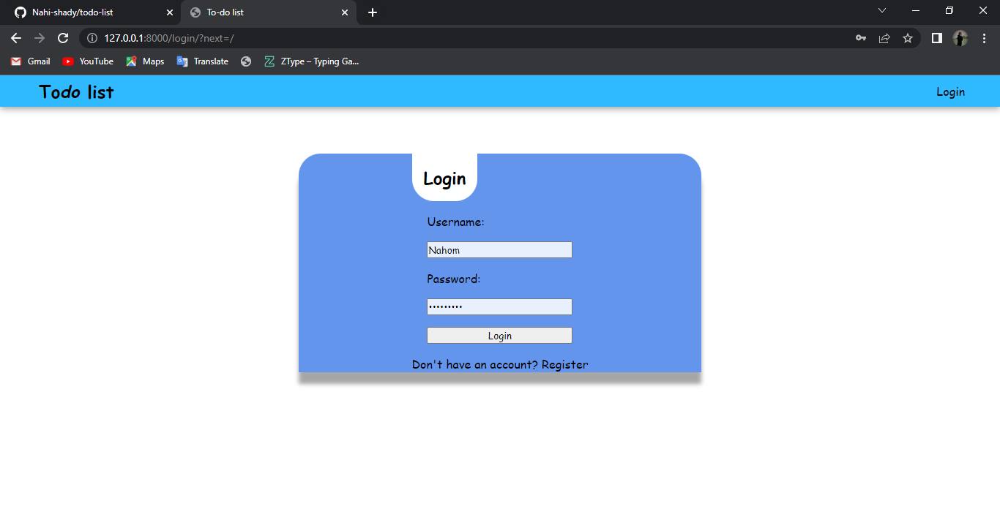
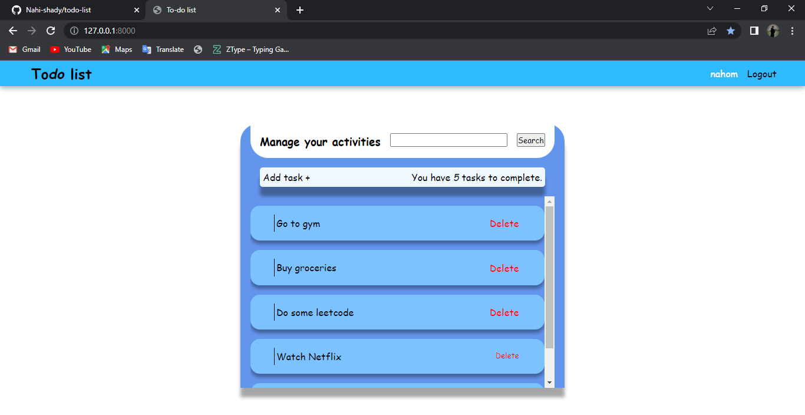
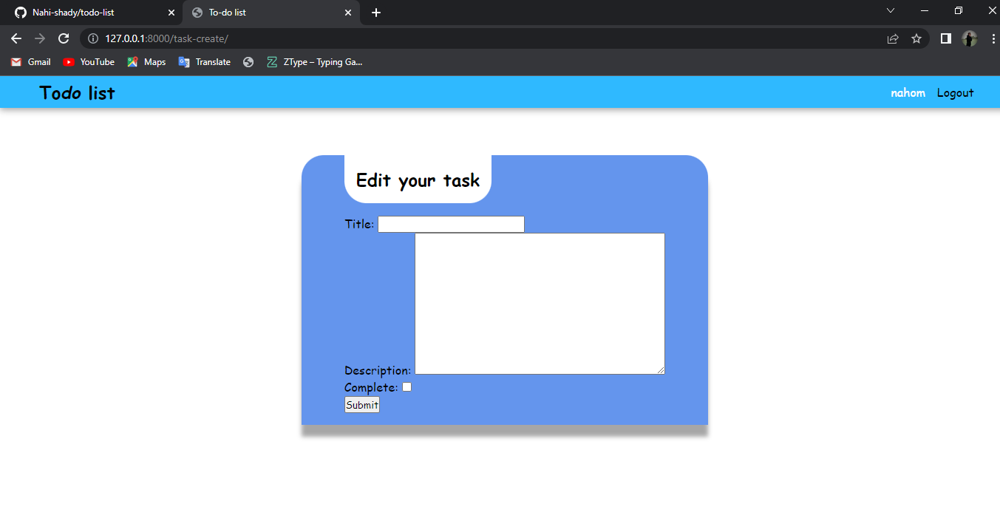
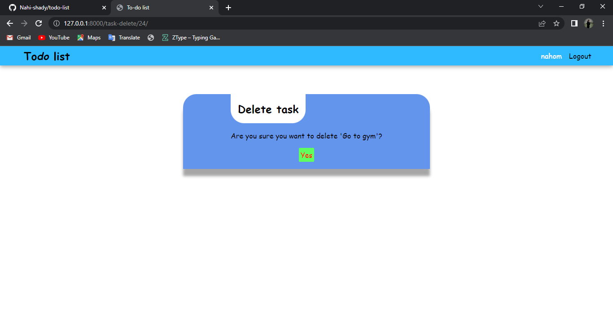

# TODO list

This project allows you to create and manage your activites. I used Pyhton-Django, Html and pure CSS, for the development.

This project lets you:

- Add new tasks
- Edit and Delete tasks
- It provides a searching functionality
- Add description for tasks and mark them completed or unmark them.
- Create a user account

## Login page

You have to create a user account to get this service.

- Creat a new account, or
- login
  

## Home page

This pages lets you

- View list of your activities
- Search
- Edit and Delete activities
  

## Add new tasks

- Add new activities
- And discription of the room(not required)

## Delete tasks

- Confirm your delete.

